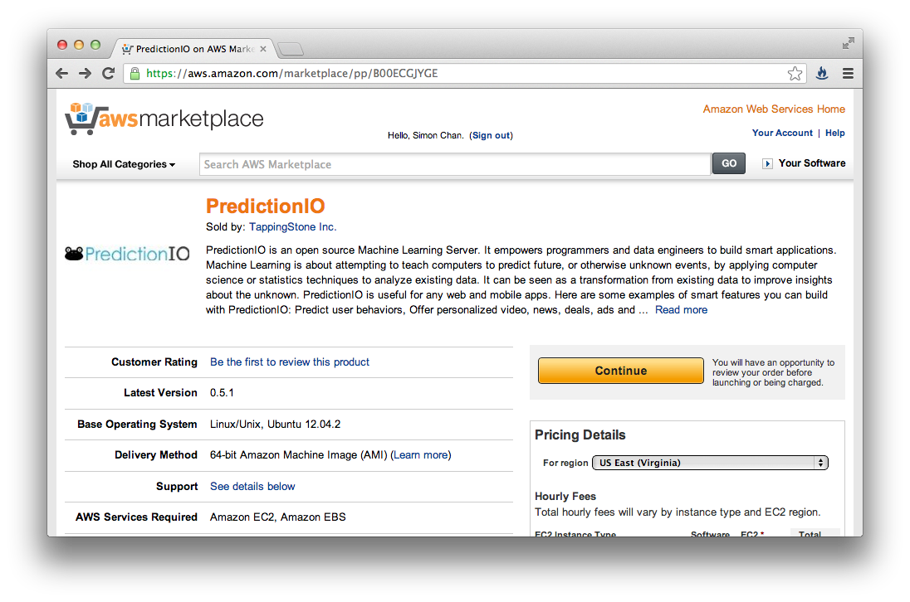
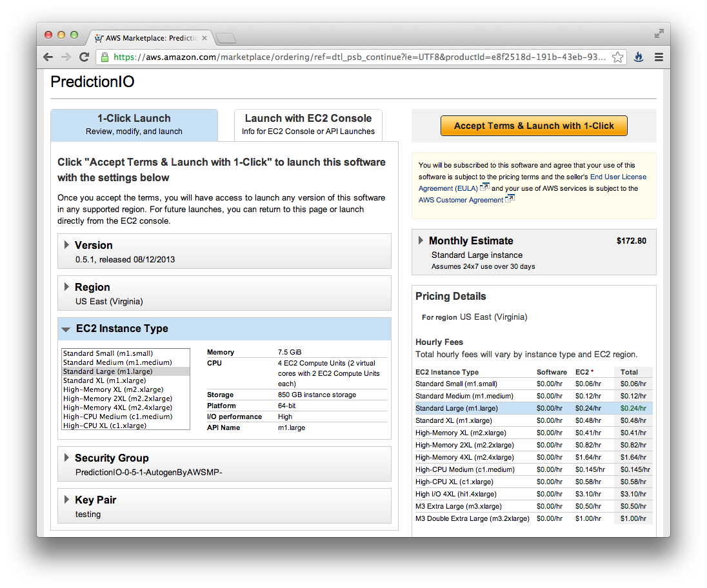

# Launching PredictionIO on AWS

Deploying PredictionIO on Amazon Web Services is extremely easy thanks
to AWS Marketplace. As long as you have access to AWS, you can launch a
ready-to-use PredictionIO Amazon EC2 instance with a single click.

## Prerequisites

* Amazon Web Services account
* Amazon EC2

## Access AWS Marketplace

Visit [PredictionIO product's page on AWS Marketplace](https://aws.amazon.com/marketplace/pp/B00ECGJYGE) and sign in with your
AWS account.

## Using 1-Click Launch

You should see the following screen after you have logged in.

Under the big yellow "Continue" botton, select the region where you want to
launch the PredictionIO EC2 instance, then click "Continue".

Review your instance's settings before launching. For quick prototyping work,
we recommend using at least the "Standard Medium (m1.medium)" instance type.
For larger loads, use "Standard Large (m1.large)" or "Standard XL (m1.xlarge)".

## Setting Security Group

The default security group, marked by "AutogenByAWSMP", has the following ports opened to public:

* 22 (SSH)
* 7070 (PredictionIO Event Server)
* 8000 (PredictionIO Server)
* 8080 (Spark Master)
* 9200 (Elasticsearch)

## Start Using PredictionIO

It may take a few minutes after the EC2 instance has launched for all
PredictionIO components to become ready. When they are ready, you may connect to your instance, see [AWS documentation](http://docs.aws.amazon.com/AWSEC2/latest/UserGuide/ec2-connect-to-instance-linux.html) for more details.

#### [Next: Recommendation Engine Quick Start](../recommendation/quickstart.html)
